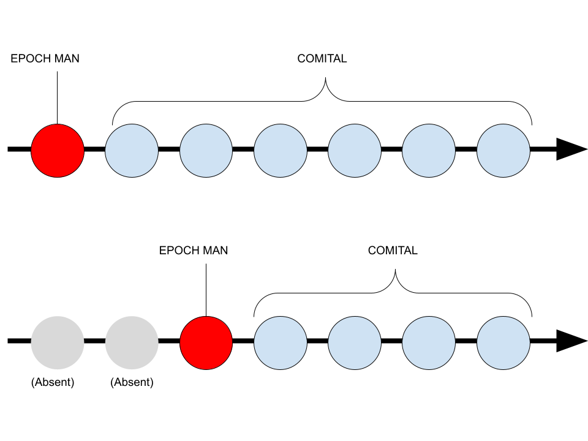

# PEPITAS VALIDATION PROTOCOL

## Prerequisites
To understand this documentation, you need to have a good understanding of the blockchain data structure used in cryptocurrencies and the concept of the proof of stake.

## Introduction
PEPITAS is a C written cryptocurrency. At the beginning of cryptocurrencies, the method (or concensus) used to guarantee the network security was the *proof of work*, users computers had to calculate some hashes to validate transactions (also called *mining*). These calculations ensure a good security,but are not eco-frendly (because of the huge amount of CPU's and GPU's in charge of calculating hashes). This issue enrolled a new concensus : the *proof of stake*. This type of validation protocol doesn't use calculations to prove a transaction validity, but the money users putted in a bank, named the *stake*. The more a user send money to the stake, the more he has a chance to be selected to create a new block, and by the time, to earn money as a reward. It is important to note that if the other users of the network detect that a validator validated fraudulent transactions, the corresponding validator will lose some part of his stake. This punishment ensure that all users have more interest to validate valid transactions instead of fraudulent ones.

## Definitions
### VALIDATOR
Members of the network who can validate and create block. Each of there **STAKE** must contains at least **50** PEPITAS.
### COMMITTEE
A list containing public keys, correpsonding to some accounts on the network. Each account in this list is allowed to participate to the validation and the creation of a new block for the blockchain network. A committee is pseudo-randomly selected and is known by every node of the network. It changes every time a block is added to the blockchain. The more a user puts money in his stake, the more he has a chance to appear and have a low ID in a committee.
### EPOCH MAN
The committee (list) ID of the block creator.
The EPOCH MAN is selected by priority order in a committee with this rule : **min(awaken_validator_ID)**
For example if the committee contains 10 members and the first awaken member is the third, EPOCH MAN is the third member of this comitte. An awaken member is a committee member who broadcast a block to the network or a committee member that send a verdict on a broadcasted block.

### COMITAL
If the committee contains **n** members and the selected EPOCH MAN is the validator with the ID **m**, the comital members ID are from **0** to **m** (excluded) and from **m+1** to **n** (excluded).

### VOTE
A vote is a validator judgment about a the validity of a certain block. If a validator think that a block is valid, he will send a **postive** vote, otherwise, he will send a **negative** one. Note that the block at height **0** (genesis block) is considered as valid by default.

### PLÈBE
All non-validators members. Each of there **STAKE** are under **50** PEPITAS.

### MEMPOOL
A directory where all pending transactions (transactions that are not in a block) are stocked.

## How EPOCH MAN creates a block
Lets admit that the current validated block is at height **n**.

To create a block, EPOCH MAN do several things :
### Last block validity checking
- First, he creates a new empty block (at height **n+1**).
- Then, he check if the validators votes ratio of the block at height **n**.
	- If the block at height **n** has more positive than negative votes.
		- Writes on the block at height **n+1** that the block at height **n** is valid.
		- Flushes the transactions in the block at height **n** from the mempool.
	- Else 
        - Writes on the block at height **n+1** that the block at height **n** is not valid.

### Rewards and punishments attribution
To motivate the network to do the job correctly (without corruption), EPOCH MAN will create new special transactions called *rewards* and *punishments*. Rewards are transactions that "*send*" money to a validator (actually this transaction creates money) and punishments that *take of* money from a validator (this transaction delete money from an account). Before this step, EPOCH MAN checked the validators votes ratio of the block at height **n**, then, he will create rewards transactions for the majority and punishments for the others. If there is equality on votes, the block is considered as non-valid and the same rule is applied.

### Broadcast
After all these steps, EPOCH MAN broadcasts his new block.

## How COMITAL send their verdicts
1. A validator waits for a block from a validator that has a lower ID than him in the next committee. If it receive one, he will start computing it.
2. Verify the validity of the received block.
3. Send a verdict.
4. Reiterate if the validator receive a block from another EPOCH MAN with an ID lower than the previous EPOCH MAN, for a certain amount of time.

Note that if a member of the COMITAL doesn't send any verdict, he will be punished by the next EPOCH MAN.

## How PLÈBE adhere blocks
1. A node waits for a block from a validator
2. Adhere all verdicts from the next committee
3. Reiterate for a certain amount of time, using the same rule as the COMITAL.
4. Keep the received block
5. If the previous block is valid (info stored in the received block), then flushes the transactions in the previous block from the mempool.